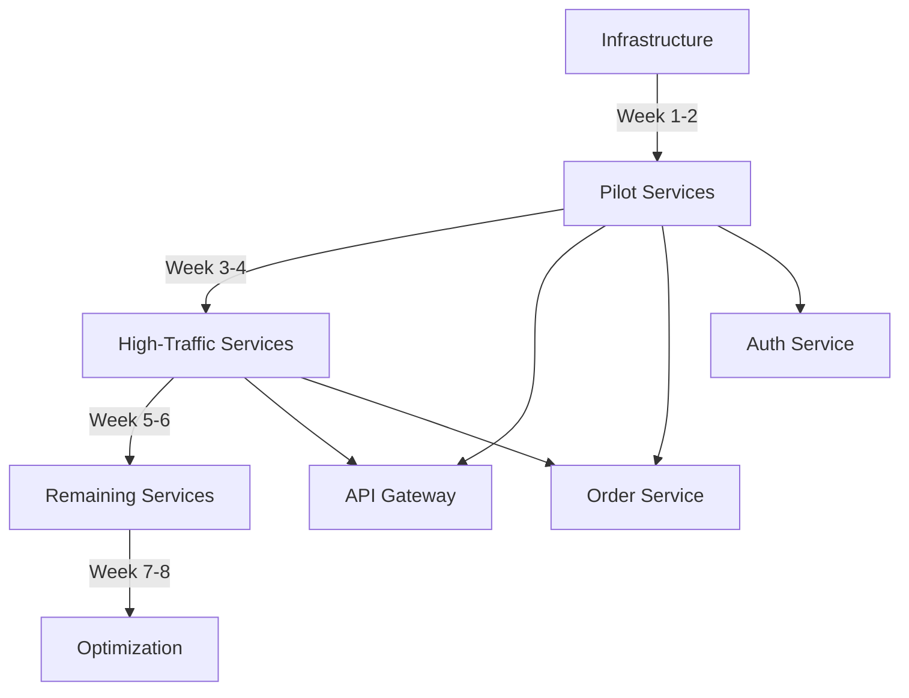

# Migration Strategy: Distributed Tracing Rollout

## Table of Contents
1. [Overview](#overview)
2. [Risk Assessment](#risk-assessment)
3. [Phased Rollout Plan](#phased-rollout-plan)
4. [Service Prioritization](#service-prioritization)
5. [Testing Strategy](#testing-strategy)
6. [Rollback Procedures](#rollback-procedures)
7. [Communication Plan](#communication-plan)
8. [Success Criteria](#success-criteria)

---

## 1. Overview

### 1.1 Migration Approach

**Strategy**: **Big Bang Infrastructure + Phased Service Rollout**

- **Infrastructure**: Deploy all tracing infrastructure at once (2 weeks)
- **Services**: Gradual service instrumentation over 8 weeks

### 1.2 Timeline

```
Week 1-2   │ Infrastructure Setup
Week 3-4   │ Pilot Services (Critical Path)
Week 5-6   │ High-Traffic Services
Week 7-8   │ Remaining Services
Week 9-10  │ Optimization & Training
───────────┼─────────────────────────────────────────
           │
Phase 1    │ Phase 2      │ Phase 3     │ Phase 4
```

### 1.3 Team Allocation

| Role | Phase 1 | Phase 2 | Phase 3 | Phase 4 |
|------|---------|---------|---------|---------|
| DevOps/SRE | 2 FTE | 1 FTE | 0.5 FTE | 0.25 FTE |
| Backend Devs | 0 | 4 FTE | 4 FTE | 2 FTE |
| QA Engineers | 0 | 1 FTE | 1 FTE | 0.5 FTE |
| Tech Lead | 0.5 FTE | 0.5 FTE | 0.25 FTE | 0.25 FTE |

---

## 2. Risk Assessment

### 2.1 Risk Matrix

| Risk | Probability | Impact | Mitigation |
|------|-------------|--------|------------|
| **Performance degradation** | Medium | High | Gradual rollout, monitoring, quick rollback |
| **Infrastructure instability** | Low | High | Extensive testing, HA setup, Kafka buffering |
| **Incomplete traces** | Medium | Medium | Context propagation testing, validation |
| **Storage overflow** | Low | High | ILM policies, monitoring, alerts |
| **Team adoption failure** | Medium | Medium | Training, documentation, champions |
| **Cost overrun** | Low | Medium | Budget tracking, optimization |
| **Data privacy issues** | Low | High | PII scrubbing, access controls |
| **Service discovery issues** | Low | Low | DNS testing, K8s service mesh |

### 2.2 Risk Mitigation Strategies

#### Performance Degradation
```
Prevention:
- Start with 100% sampling at app, filter at collector
- Use async span export
- Batch aggressively
- Monitor latency metrics

Detection:
- Automated performance tests
- SLA monitoring
- User-facing latency alerts

Response:
- Immediate rollback capability
- Feature flags to disable tracing
- Scale collector resources
```

#### Infrastructure Instability
```
Prevention:
- HA deployment (3+ replicas)
- Kafka buffering
- Resource limits & requests
- Health checks

Detection:
- Prometheus alerts
- Log monitoring
- Synthetic checks

Response:
- Auto-scaling
- Runbook for common issues
- 24/7 on-call rotation
```

### 2.3 Rollback Triggers

Automatically rollback if:
- [ ] Service latency increases >5% for 10 minutes
- [ ] Error rate increases >2% for 5 minutes
- [ ] OTel Collector CPU >90% sustained
- [ ] Elasticsearch disk >95%
- [ ] Kafka lag >1 million messages

---

## 3. Phased Rollout Plan

### Phase 1: Infrastructure Setup (Week 1-2)

**Goal**: Deploy production-ready tracing infrastructure

#### Week 1: Core Components
- **Day 1-2**: Deploy Elasticsearch cluster
  - 3-node cluster
  - Configure ILM policies
  - Set up monitoring
  - Backup strategy

- **Day 3-4**: Deploy Kafka cluster
  - 3-node cluster
  - Create topics
  - Configure retention
  - Performance tuning

- **Day 5**: Deploy Jaeger
  - Collector (3 replicas)
  - Query (2 replicas)
  - Ingester (3 replicas)
  - UI exposure via Ingress

#### Week 2: Collection & Validation
- **Day 1-2**: Deploy OTel Collectors
  - DaemonSet (agent mode)
  - Deployment (gateway mode)
  - Configure pipelines

- **Day 3-4**: Integration Testing
  - Synthetic trace generation
  - End-to-end flow testing
  - Performance validation

- **Day 5**: Documentation & Training
  - Runbook creation
  - Team walkthrough
  - Access provisioning

**Exit Criteria**:
- [ ] All infrastructure components healthy
- [ ] Synthetic traces flowing end-to-end
- [ ] Query latency <500ms (p99)
- [ ] Monitoring dashboards operational
- [ ] Runbooks complete
- [ ] Team trained on basics

---

### Phase 2: Pilot Services (Week 3-4)

**Goal**: Instrument 3-5 critical services to validate approach

#### Service Selection Criteria
1. **Critical to user experience** ✅
2. **Well-understood codebase** ✅
3. **Moderate traffic volume** ✅
4. **Good test coverage** ✅
5. **Supportive team** ✅

#### Recommended Pilot Services

| Service | Language | Reason | Owner |
|---------|----------|--------|-------|
| **API Gateway** | Java | Entry point, sees all traffic | Platform Team |
| **Order Service** | Java | Critical path, database heavy | Orders Team |
| **Inventory Service** | Python | Mid-tier, external calls | Inventory Team |
| **Notification Service** | Erlang | Validates Erlang support | Notifications Team |
| **Auth Service** | Java | Critical but isolated | Security Team |

#### Week 3: Instrumentation
- **Day 1**: API Gateway instrumentation
  - Add Java agent
  - Deploy to staging
  - Validate traces

- **Day 2**: Order Service instrumentation
  - Add Java agent
  - Add custom spans for business logic
  - Test database tracing

- **Day 3**: Inventory Service instrumentation
  - Install Python OTel SDK
  - Auto-instrument frameworks
  - Test HTTP client tracing

- **Day 4**: Notification Service instrumentation
  - Add Erlang OTel library
  - Manual span creation
  - Test MQTT/EMQX tracing

- **Day 5**: Auth Service instrumentation
  - Add Java agent
  - Validate security (no PII in traces)
  - Performance testing

#### Week 4: Production Deployment
- **Day 1**: Deploy API Gateway to production
  - Blue-green deployment
  - Monitor closely
  - Gather feedback

- **Day 2**: Deploy Order Service
  - Canary deployment (10% → 50% → 100%)
  - Validate trace completeness

- **Day 3**: Deploy Inventory & Notification Services
  - Rolling deployment
  - Cross-service trace validation

- **Day 4**: Deploy Auth Service
  - Extra security validation
  - PII scrubbing verification

- **Day 5**: Retrospective & Optimization
  - Team feedback
  - Performance analysis
  - Adjust sampling if needed

**Exit Criteria**:
- [ ] All 5 pilot services instrumented
- [ ] End-to-end traces visible in Jaeger
- [ ] Performance impact <1%
- [ ] No production incidents
- [ ] Team feedback positive
- [ ] Process documented

---

### Phase 3: High-Traffic Services (Week 5-6)

**Goal**: Instrument 15-20 high-traffic services

#### Service Categories

**Batch 1 (Week 5)**: Customer-Facing Services
- User Service
- Product Catalog Service
- Search Service
- Shopping Cart Service
- Pricing Service
- Recommendation Service
- Review Service

**Batch 2 (Week 6)**: Backend Services
- Payment Service
- Shipping Service
- Warehouse Service
- Returns Service
- Analytics Service
- Reporting Service
- Integration Service

#### Instrumentation Approach

**Parallel Teams**:
- Team A: Java services (4 devs)
- Team B: Python services (2 devs)
- Team C: Erlang services (2 devs)

**Daily Rhythm**:
- Morning: Instrument 2-3 services
- Afternoon: Deploy to staging, test
- Evening: Deploy to production (off-peak)

**Deployment Strategy**: **Rolling Deployment**
- Deploy to 25% of pods
- Monitor for 1 hour
- Deploy to 50% of pods
- Monitor for 1 hour
- Deploy to 100% of pods

#### Monitoring & Validation

**Automated Checks**:
```yaml
# Example CI/CD check
- name: Validate Tracing
  run: |
    # Generate test request
    TRACE_ID=$(curl -s -i https://api.staging.com/test | grep X-Trace-Id | cut -d' ' -f2)

    # Wait for trace to be ingested
    sleep 10

    # Query Jaeger API
    TRACE=$(curl -s "http://jaeger-query:16686/api/traces/${TRACE_ID}")

    # Validate trace has expected services
    echo $TRACE | jq '.data[0].spans | map(.process.serviceName) | unique' | \
      grep -q "api-gateway" && \
      grep -q "order-service" || exit 1
```

**Exit Criteria**:
- [ ] 15-20 services instrumented
- [ ] All services appear in Jaeger service list
- [ ] Service dependency graph accurate
- [ ] No P1/P2 incidents
- [ ] Performance SLAs met

---

### Phase 4: Remaining Services (Week 7-8)

**Goal**: Achieve 100% service coverage

#### Long Tail Services
- Internal tools
- Admin panels
- Batch jobs
- Cron jobs
- Background workers
- Legacy services

#### Approach

**Self-Service**:
- Teams instrument their own services
- Platform team provides support
- Office hours for questions

**Documentation**:
- Step-by-step guides per language
- Video tutorials
- FAQ document
- Slack channel for support

#### Batch Jobs & Workers

**Special Considerations**:
```python
# Example: Batch job tracing
from opentelemetry import trace
from opentelemetry.sdk.trace import TracerProvider
from opentelemetry.sdk.trace.export import BatchSpanProcessor
from opentelemetry.exporter.otlp.proto.grpc.trace_exporter import OTLPSpanExporter

# Initialize tracing
provider = TracerProvider()
exporter = OTLPSpanExporter(endpoint="http://otel-collector:4317")
provider.add_span_processor(BatchSpanProcessor(exporter))
trace.set_tracer_provider(provider)

tracer = trace.get_tracer(__name__)

# Create root span for batch job
with tracer.start_as_current_span("daily_report_generation") as span:
    span.set_attribute("job.type", "batch")
    span.set_attribute("job.schedule", "daily")

    # Process records
    for record in records:
        with tracer.start_as_current_span("process_record") as record_span:
            process(record)

    # Flush traces before exit
    provider.force_flush()
```

**Exit Criteria**:
- [ ] 100% of production services instrumented
- [ ] All service types covered (APIs, workers, jobs)
- [ ] Documentation complete
- [ ] Self-service process validated

---

### Phase 5: Optimization & Training (Week 9-10)

**Goal**: Optimize system and enable teams

#### Week 9: Optimization
- **Sampling Tuning**: Adjust based on data volume
- **Storage Optimization**: Fine-tune ILM policies
- **Query Performance**: Add indices, optimize queries
- **Cost Analysis**: Review infrastructure costs
- **Alerting Setup**: Configure alerts for trace system

#### Week 10: Training & Enablement
- **Workshop 1**: Using Jaeger UI (2 hours)
  - Finding traces
  - Reading timeline
  - Service dependency graph
  - Advanced search

- **Workshop 2**: Debugging with Traces (2 hours)
  - Root cause analysis
  - Performance investigation
  - Error correlation
  - Real-world examples

- **Workshop 3**: Custom Instrumentation (2 hours)
  - Manual span creation
  - Adding attributes
  - Context propagation
  - Best practices

- **Documentation Day**: Update all docs
  - Runbooks
  - Troubleshooting guides
  - FAQ
  - Video recordings

**Exit Criteria**:
- [ ] System optimized for production load
- [ ] All teams trained
- [ ] Documentation complete and accessible
- [ ] Support process established
- [ ] Success metrics tracked

---

## 4. Service Prioritization

### 4.1 Prioritization Framework

**Score = (Business Impact × 3) + (Complexity × 2) + (Team Readiness × 1)**

| Service | Business Impact (1-5) | Complexity (1-5) | Team Readiness (1-5) | Score | Priority |
|---------|----------------------|------------------|---------------------|-------|----------|
| API Gateway | 5 | 2 | 5 | 27 | P0 |
| Order Service | 5 | 3 | 5 | 32 | P0 |
| Payment Service | 5 | 4 | 4 | 31 | P0 |
| Auth Service | 5 | 2 | 5 | 27 | P0 |
| Inventory Service | 4 | 3 | 4 | 22 | P1 |
| Notification Service | 3 | 4 | 3 | 23 | P1 |
| Search Service | 4 | 2 | 4 | 20 | P1 |
| ... | ... | ... | ... | ... | ... |

### 4.2 Dependencies



---

## 5. Testing Strategy

### 5.1 Test Levels

#### Level 1: Unit Tests (Developer)
```java
@Test
public void testSpanCreation() {
    Span span = tracer.spanBuilder("test-operation").startSpan();
    span.setAttribute("test.key", "test.value");
    span.end();

    // Verify span was created (mock or test exporter)
    assertThat(exportedSpans).hasSize(1);
    assertThat(exportedSpans.get(0).getName()).isEqualTo("test-operation");
}
```

#### Level 2: Integration Tests (QA)
```python
def test_end_to_end_trace():
    # Generate request with trace context
    headers = {'traceparent': '00-0af7651916cd43dd8448eb211c80319c-b7ad6b7169203331-01'}
    response = requests.post('http://api/orders', json=order_data, headers=headers)

    # Wait for trace propagation
    time.sleep(5)

    # Query Jaeger for trace
    trace = query_jaeger_trace('0af7651916cd43dd8448eb211c80319c')

    # Verify expected spans
    assert 'api-gateway' in trace.services
    assert 'order-service' in trace.services
    assert 'inventory-service' in trace.services
    assert len(trace.spans) >= 10
```

#### Level 3: Performance Tests
```bash
# Before instrumentation
ab -n 10000 -c 100 https://api.com/test > before.txt

# After instrumentation
ab -n 10000 -c 100 https://api.com/test > after.txt

# Compare (should be <1% difference)
python compare_perf.py before.txt after.txt
```

#### Level 4: Chaos Tests
```yaml
# Chaos Engineering: OTel Collector failure
apiVersion: chaos-mesh.org/v1alpha1
kind: PodChaos
metadata:
  name: collector-failure
spec:
  action: pod-kill
  mode: one
  selector:
    namespaces:
      - observability
    labelSelectors:
      app: otel-collector-gateway
  scheduler:
    cron: "*/10 * * * *"  # Kill one pod every 10 minutes

# Verify: Services continue to function, traces buffer in Kafka
```

### 5.2 Test Checklist per Service

- [ ] Service appears in Jaeger service list
- [ ] Trace context propagated to downstream services
- [ ] Database queries captured in spans
- [ ] HTTP calls to external services traced
- [ ] Message queue operations traced
- [ ] Errors recorded with stack traces
- [ ] Custom business spans present
- [ ] Performance impact <1%
- [ ] No PII in span attributes
- [ ] Logs correlated with traces (trace ID present)

---

## 6. Rollback Procedures

### 6.1 Service-Level Rollback

**Trigger**: Service experiencing issues after instrumentation

**Procedure**:

```bash
# Option 1: Disable tracing via environment variable
kubectl set env deployment/myservice OTEL_SDK_DISABLED=true -n production

# Option 2: Remove Java agent (requires redeploy)
kubectl set env deployment/myservice JAVA_TOOL_OPTIONS="" -n production
kubectl rollout restart deployment/myservice -n production

# Option 3: Rollback to previous version
kubectl rollout undo deployment/myservice -n production

# Verify
kubectl rollout status deployment/myservice -n production
```

**Timeline**: 2-5 minutes

### 6.2 Infrastructure Rollback

**Trigger**: Widespread issues with tracing infrastructure

**Procedure**:

```bash
# Emergency: Stop all collectors (stops ingestion)
kubectl scale deployment/otel-collector-gateway --replicas=0 -n observability
kubectl delete daemonset/otel-collector-agent -n observability

# Services continue to function (traces dropped, buffered in app memory)
# Applications will log warnings but continue processing

# Timeline: 30 seconds
```

### 6.3 Partial Rollback

**Scenario**: Keep infrastructure, disable tracing for subset of services

**Procedure**:

```bash
# Create ConfigMap with service allow-list
kubectl create configmap tracing-allowlist \
  --from-literal=enabled-services="service-a,service-b,service-c" \
  -n observability

# Update OTel Collector to filter by service name
# (requires collector config change)

# Or: Use feature flags
kubectl set env deployment/service-d TRACING_ENABLED=false
```

### 6.4 Rollback Decision Matrix

| Issue | Severity | Affected Services | Action | Timeline |
|-------|----------|-------------------|--------|----------|
| Single service latency +2% | Low | 1 | Investigate, may continue | N/A |
| Single service latency +10% | Medium | 1 | Disable tracing for service | 5 min |
| Multiple services latency +5% | High | 5+ | Scale collectors, investigate | 10 min |
| Infrastructure outage | Critical | All | Stop collectors, investigate | 2 min |
| Data privacy breach | Critical | Any | Stop all, audit, remediate | Immediate |

---

## 7. Communication Plan

### 7.1 Stakeholders

| Stakeholder | Interest | Communication Frequency |
|-------------|----------|------------------------|
| Engineering Teams | Direct impact | Weekly updates |
| Product Managers | Feature velocity | Bi-weekly updates |
| SRE Team | Operations | Daily during rollout |
| CTO/VPE | Strategic alignment | Monthly |
| Security Team | Compliance | As needed |

### 7.2 Communication Channels

**Before Rollout**:
- All-hands presentation (30 min)
- Detailed RFC document
- Q&A session
- Survey for concerns

**During Rollout**:
- Daily Slack updates in #distributed-tracing
- Weekly email summary
- Office hours (Tue/Thu 2-3pm)
- War room (virtual) during critical phases

**After Rollout**:
- Retrospective document
- Success metrics dashboard
- Lessons learned presentation
- Continuous improvement backlog

### 7.3 Incident Communication

**Template**:

```
Subject: [TRACING] Issue with Service X - Action Required

Severity: [P1/P2/P3]
Affected Services: [List]
Impact: [Description]
Status: [Investigating/Mitigating/Resolved]

Details:
[What happened]

Action Required:
[What teams need to do, if anything]

Next Update: [Time]

Slack: #incident-response
```

---

## 8. Success Criteria

### 8.1 Technical Metrics

| Metric | Target | Measurement Method |
|--------|--------|--------------------|
| Service Coverage | 100% | Jaeger service count |
| Trace Completion Rate | >95% | Span count validation |
| Query Latency (p99) | <500ms | Jaeger API metrics |
| Performance Impact | <1% | Before/after benchmarks |
| Data Freshness | <30s | Timestamp comparison |
| System Uptime | 99.9% | Prometheus metrics |

### 8.2 Business Metrics

| Metric | Target | Measurement Method |
|--------|--------|--------------------|
| MTTR Reduction | 40% | Incident resolution time |
| Team Adoption | 80% | Survey + usage analytics |
| Incidents Debugged w/ Traces | 70% | Post-incident reviews |
| Developer Satisfaction | 4/5 | Quarterly survey |
| Cost vs. Budget | ±10% | Financial tracking |

### 8.3 Adoption Metrics

| Metric | Target | Measurement Method |
|--------|--------|--------------------|
| Traces Viewed/Week | 1000+ | Jaeger analytics |
| Unique Users/Week | 50+ | Authentication logs |
| Training Completion | 90% | LMS tracking |
| Runbook Usage | 20+ views/month | Documentation analytics |

### 8.4 Go-Live Checklist

- [ ] All Phase 1 services in production
- [ ] Performance impact validated
- [ ] No P1/P2 incidents in past week
- [ ] Documentation complete
- [ ] Training sessions delivered
- [ ] Support process established
- [ ] Monitoring & alerting operational
- [ ] Budget approved for ongoing costs
- [ ] Security review passed
- [ ] Architecture review approved

---

## 9. Post-Migration

### 9.1 Continuous Improvement

**Monthly Reviews**:
- Usage metrics
- Cost analysis
- Performance trends
- Team feedback

**Quarterly Objectives**:
- Q1: Achieve 100% coverage, optimize sampling
- Q2: Advanced features (span links, baggage)
- Q3: Integrate with incident management
- Q4: Expand to logs & metrics (full observability)

### 9.2 Long-Term Roadmap

**6 Months**:
- Anomaly detection
- Automated root cause analysis
- Cost optimization
- Advanced sampling strategies

**12 Months**:
- Full observability (traces + metrics + logs)
- AI-powered insights
- Multi-cluster tracing
- Custom UI/dashboards

---

## 10. Appendix

### 10.1 Template: Service Instrumentation Checklist

```markdown
# Service: [Name]
# Owner: [Team]
# Language: [Java/Python/Erlang/Node.js]
# Priority: [P0/P1/P2/P3]

## Pre-Instrumentation
- [ ] Review service architecture
- [ ] Identify critical paths
- [ ] Review dependencies
- [ ] Check test coverage
- [ ] Backup configuration

## Instrumentation
- [ ] Add OTel SDK/agent
- [ ] Configure endpoints
- [ ] Add custom spans (if needed)
- [ ] Update Dockerfile
- [ ] Update K8s manifests

## Testing
- [ ] Unit tests pass
- [ ] Integration tests pass
- [ ] Performance tests pass
- [ ] Trace validation in staging
- [ ] Security scan passed

## Deployment
- [ ] Deploy to staging
- [ ] Smoke test
- [ ] Deploy to production (canary)
- [ ] Monitor for 2 hours
- [ ] Full rollout

## Validation
- [ ] Service in Jaeger list
- [ ] Traces complete
- [ ] Performance OK
- [ ] No errors
- [ ] Team notified

## Rollback Plan
- Rollback command: `kubectl rollout undo deployment/[name]`
- Responsible: [Name]
- Escalation: [Manager]
```

---

*Document Version: 1.0*
*Last Updated: October 15, 2025*
*Status: Migration Ready*
