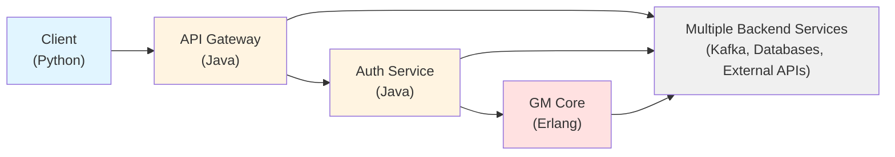
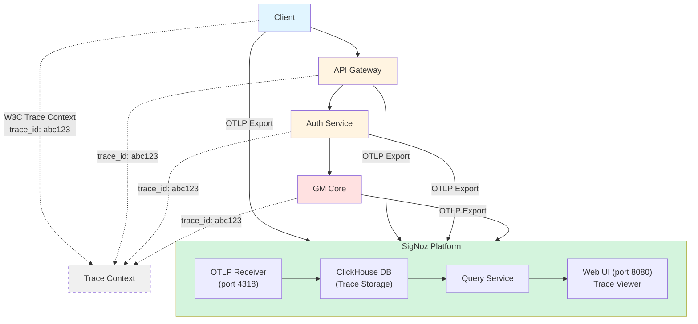
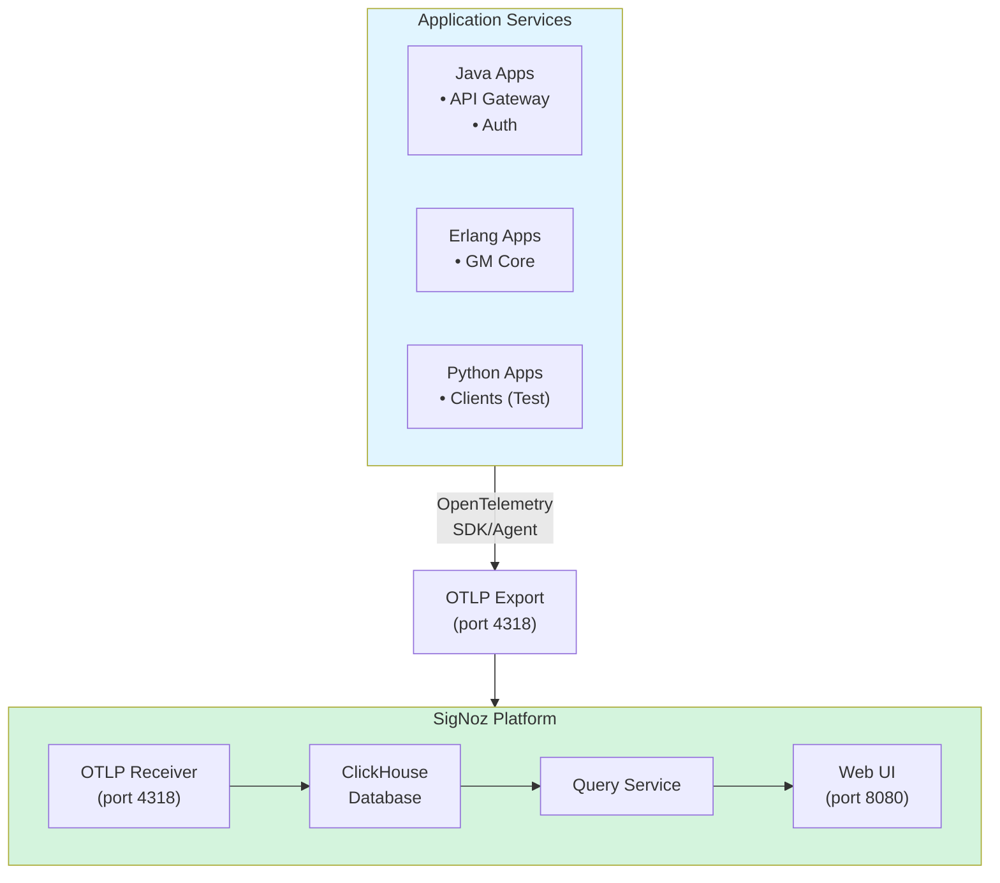
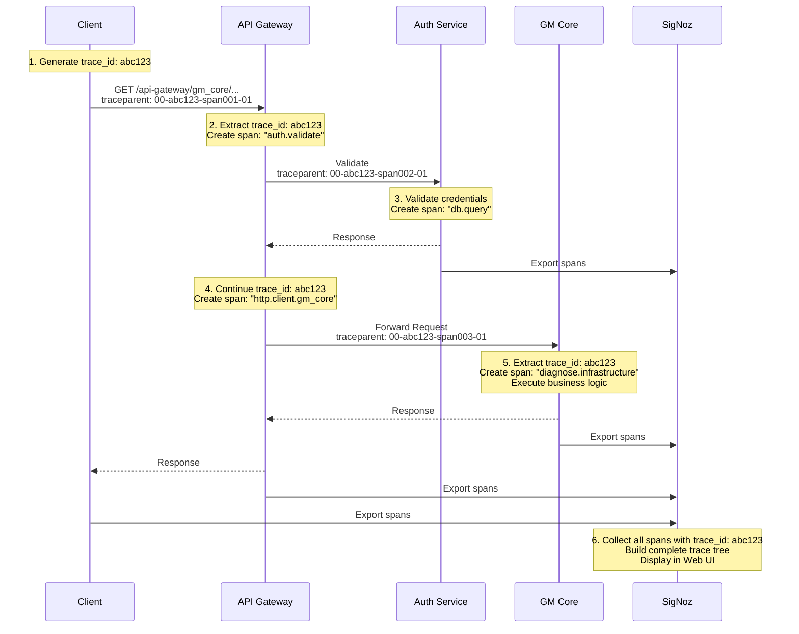

# OpenTelemetry + SigNoz Distributed Tracing
## Executive Summary & High-Level Design

**Document Version:** 1.0
**Last Updated:** November 2025
**Status:** Production Implementation Plan

---

## Table of Contents

1. [Executive Overview](#executive-overview)
2. [Business Case](#business-case)
3. [Technology Selection](#technology-selection)
4. [High-Level Architecture](#high-level-architecture)
5. [Cost-Benefit Analysis](#cost-benefit-analysis)
6. [Rollout Strategy](#rollout-strategy)
7. [Success Metrics](#success-metrics)
8. [Risk Assessment](#risk-assessment)
9. [Recommendations](#recommendations)

---

## Executive Overview

### Problem Statement

In our distributed microservices architecture spanning multiple technology stacks (Erlang, Java, Python), we face critical challenges:

- **❌ No end-to-end visibility** across service boundaries
- **❌ Difficult to trace requests** through multiple services
- **❌ Mean Time To Resolution (MTTR)** is high for production issues
- **❌ Performance bottlenecks** are hard to identify
- **❌ Manual correlation** of logs across services is time-consuming

### Solution: OpenTelemetry + SigNoz

We propose implementing **OpenTelemetry (OTel)** for distributed tracing with **SigNoz** as the observability backend.

**Key Benefits:**
- ✅ **Complete request visibility** from client → gateway → auth → backend
- ✅ **Industry standard** (CNCF graduated project)
- ✅ **Vendor-neutral** (no lock-in)
- ✅ **Multi-language support** (Python, Java, Erlang, Go, etc.)
- ✅ **Cost-effective** (open-source + self-hosted)
- ✅ **Production-ready** (used by Google, Microsoft, AWS, Uber, Shopify)

### Current Architecture

**Problem:** No unified view of request flow, errors, or performance.

### Proposed Architecture with Tracing

**Benefit:** Complete visibility with shared `trace_id` across all services.

---

## Business Case

### Current Pain Points
- Request timeout debugging
- Performance degradation
- Inter-service errors
- API failure analysis
- Resource bottlenecks

### Expected Improvements
- Improved debugging efficiency
- Reduced MTTR
- Faster identification of bottlenecks
- Improved performance analysis
- Reduced production issue resolution time
- Improved cross-service debugging

---

## Technology Selection

### Why OpenTelemetry?

OpenTelemetry (OTel) is the **industry standard** for observability instrumentation.

#### Key Advantages

| Feature                    | Benefit                                         |
| -------------------------- | ----------------------------------------------- |
| **CNCF Graduated Project** | Production-ready, industry-backed               |
| **Vendor Neutral**         | No lock-in, switch backends anytime             |
| **Multi-Language Support** | Python, Java, Erlang, Go, .NET, Rust, Ruby, PHP |
| **W3C Standard**           | Uses W3C Trace Context for propagation          |
| **Auto-Instrumentation**   | Minimal code changes required                   |
| **Future-Proof**           | All vendors converging on OTel                  |

#### Industry Adoption

**Companies using OpenTelemetry in production:**
- Google Cloud (Cloud Trace)
- Microsoft Azure (Application Insights)
- AWS (X-Ray supports OTLP)
- Uber, Shopify, Spotify, GitHub
- Every major observability vendor

### Alternatives Comparison

| Solution                   | Pros                                                                         | Cons                                                  | Verdict                |
| -------------------------- | ---------------------------------------------------------------------------- | ----------------------------------------------------- | ---------------------- |
| **OpenTelemetry + SigNoz** | ✅ Open-source ✅ Vendor-neutral ✅ Multi-language ✅ Cost-effective | ⚠️ Self-hosted management                              | ✅ **RECOMMENDED**      |
| **Jaeger Client**          | ✅ Lightweight                                                                | ❌ Deprecated (recommends OTel) ❌ Limited features | ❌ Avoid                |
| **Zipkin**                 | ✅ Simple                                                                     | ❌ Non-standard (B3 format) ❌ Declining adoption   | ❌ Avoid                |
| **Datadog APM**            | ✅ Best-in-class UI ✅ Managed service                                     | ❌ **Expensive** ($5K-50K+/month) ❌ Vendor lock-in | ⚠️ Budget-dependent     |
| **New Relic**              | ✅ Full APM suite ✅ Managed                                               | ❌ **Expensive** ($3K-30K+/month) ❌ Vendor lock-in | ⚠️ Budget-dependent     |
| **Elastic APM**            | ✅ Integrates with ELK                                                        | ❌ Complex setup ❌ Resource-heavy                  | ⚠️ If already using ELK |

### Why SigNoz?

| Feature                | Description                              |
| ---------------------- | ---------------------------------------- |
| **Open-Source**        | Apache 2.0 license, free to use          |
| **OTLP Native**        | Built specifically for OpenTelemetry     |
| **ClickHouse Backend** | Fast columnar database, great for traces |
| **Modern UI**          | Clean, intuitive trace visualization     |
| **Self-Hosted**        | Data sovereignty, no vendor dependency   |
| **Active Development** | Growing community, regular updates       |

**Alternatives to SigNoz:**
- **Jaeger:** Older, less feature-rich
- **Grafana Tempo:** Good, but requires more setup
- **SigNoz Cloud:** Managed option if self-hosting is a concern

---

## High-Level Architecture

### System Components

### Trace Flow Example

**Scenario:** User requests order diagnostics

**Result:** Complete visibility from Client → Gateway → Auth → GMCore

### Technology Stack by Service

| Service            | Language | OTel Implementation | Auto-Instrumentation         |
| ------------------ | -------- | ------------------- | ---------------------------- |
| **API Gateway**    | Java     | Java Agent          | ✅ Spring WebFlux, HTTP, JDBC |
| **Auth Service**   | Java     | Java Agent          | ✅ Spring MVC, Tomcat, JDBC   |
| **GM Core**        | Erlang   | OTel Erlang SDK     | ✅ HTTP, Partial Kafka        |
| **Python Clients** | Python   | OTel Python SDK     | ✅ requests library           |

---

## Application Performance Impact

| Service Type          | CPU Overhead | Memory Overhead | Network Overhead |
| --------------------- | ------------ | --------------- | ---------------- |
| **Java (with agent)** | < 1%         | 50-100MB        | ~1KB/request     |
| **Erlang (SDK)**      | < 1%         | 10-50MB         | ~1KB/request     |
| **Python (SDK)**      | < 1%         | 10-30MB         | ~1KB/request     |

**Impact Assessment:** **Negligible** - Production systems typically won't notice the overhead.

### Qualitative Benefits

- ✅ **Improved Developer Productivity** - Less time debugging, more time building
- ✅ **Better Customer Experience** - Faster issue resolution, less downtime
- ✅ **Enhanced System Understanding** - Visual map of system behavior
- ✅ **Proactive Problem Detection** - Identify issues before customers report them
- ✅ **Data-Driven Optimization** - Performance improvements based on real data
- ✅ **Reduced Cognitive Load** - No more mental correlation of logs

---

## Environment Strategy

| Environment                   | Sampling Rate         | Purpose                            |
| ----------------------------- | --------------------- | ---------------------------------- |
| **Development**               | 100% (always_on)      | Full visibility for debugging      |
| **Staging**                   | 100% (always_on)      | Performance testing & validation   |
| **Production (Pilot)**        | 100% (always_on)      | Initial validation of 1-2 services |
| **Production (Full)**         | 10% (trace_id_ratio)  | Balance visibility vs overhead     |
| **Production (High-Traffic)** | 1-5% (trace_id_ratio) | High-volume services               |

## Risk Mitigation

| Risk                     | Mitigation Strategy                                                                                |
| ------------------------ | -------------------------------------------------------------------------------------------------- |
| **Performance Impact**   | • Start with 10% sampling • Monitor CPU/memory • Emergency off switch ready                |
| **Resource Exhaustion**  | • Right-size SigNoz infrastructure • Set data retention policies • Monitor disk usage      |
| **Service Disruption**   | • Deploy during low-traffic windows • Rollback plan ready • Gradual rollout                |
| **Configuration Errors** | • Thorough testing in dev/staging • Configuration validation scripts • Peer review process |

---

## Success Metrics

### Key Performance Indicators (KPIs)

#### Operational Metrics
- Reduce Mean Time To Detection
- Reduce Mean Time To Resolution
- Debug Time per Issue*
- P1 Incident Resolution Time

#### System Health Metrics

| Metric                        | Target     | Monitoring          |
| ----------------------------- | ---------- | ------------------- |
| **Trace Sampling Rate**       | 10% (prod) | SigNoz dashboard    |
| **Trace Export Success Rate** | > 99.5%    | OTel metrics        |
| **End-to-End Latency Impact** | < 1ms      | Application metrics |
| **SigNoz Query Performance**  | < 2s (p95) | SigNoz UI           |

---

## Risk Assessment

### Technical Risks

| Risk                        | Probability | Impact | Mitigation                                                                                   |
| --------------------------- | ----------- | ------ | -------------------------------------------------------------------------------------------- |
| **Performance Degradation** | Low         | High   | • Start with low sampling (10%) • Monitor continuously • Emergency disable mechanism |
| **Storage Capacity**        | Medium      | Medium | • Implement data retention policies • Monitor disk usage • Scale storage proactively |
| **Network Overhead**        | Low         | Low    | • Batch span export (default) • Compression enabled • Monitor network metrics        |
| **OTel SDK Bugs**           | Low         | Medium | • Use stable versions only • Test thoroughly in staging • Have rollback plan         |

### Operational Risks

| Risk                      | Probability | Impact | Mitigation                                                                                       |
| ------------------------- | ----------- | ------ | ------------------------------------------------------------------------------------------------ |
| **Team Adoption**         | Medium      | High   | • Comprehensive training • Clear documentation • Regular demos & success stories         |
| **Configuration Drift**   | Medium      | Low    | • Infrastructure as Code • Configuration validation • Regular audits                     |
| **SigNoz Downtime**       | Low         | Medium | • High availability setup • Monitoring & alerting • Application continues without traces |
| **Data Privacy Concerns** | Low         | High   | • Never log PII in spans • Attribute sanitization • Regular security reviews             |  |

### Overall Risk Rating: **LOW**

**Why Low Risk:**
- ✅ Industry-standard technology (OTel)
- ✅ Minimal code changes required
- ✅ Gradual rollout strategy
- ✅ Emergency off switch available
- ✅ Strong community support
- ✅ Proven in production at scale

---

### Decision Required

- [ ] Infrastructure provisioning (SigNoz servers)
- [ ] Rollout timeline

---

## Appendices

### Appendix A: Technology Stack Summary

| Component                  | Technology        | Version | Purpose                |
| -------------------------- | ----------------- | ------- | ---------------------- |
| **Instrumentation**        | OpenTelemetry     | 1.x+    | Trace generation       |
| **Java Instrumentation**   | OTel Java Agent   | 2.10.0+ | Auto-instrumentation   |
| **Erlang Instrumentation** | opentelemetry_api | 1.8+    | Manual instrumentation |
| **Protocol**               | OTLP/HTTP         | 1.0     | Trace export           |
| **Backend**                | SigNoz            | Latest  | Trace storage & UI     |
| **Database**               | ClickHouse        | 23.x+   | Trace persistence      |

### Appendix B: References

**OpenTelemetry:**
- Official Docs: https://opentelemetry.io
- CNCF Project: https://www.cncf.io/projects/opentelemetry/
- W3C Trace Context: https://www.w3.org/TR/trace-context/

**SigNoz:**
- Official Docs: https://signoz.io/docs/
- GitHub: https://github.com/SigNoz/signoz
- Deployment Guide: https://signoz.io/docs/install/

---

**Document Status:** ✅ Ready for Review
**Next Review Date:** Post-implementation

