# OpenTelemetry + SigNoz Distributed Tracing
## Technical Architecture & Performance Analysis

**Document Version:** 1.0
**Last Updated:** November 2025
**Target Audience:** Technical Teams, Architects, Developers

---

## Table of Contents

1. [Architecture Overview](#architecture-overview)
2. [Language-Specific Implementation](#language-specific-implementation)
3. [Performance Impact Analysis](#performance-impact-analysis)
4. [Auto-Instrumentation Support](#auto-instrumentation-support)
5. [Resource Requirements](#resource-requirements)
6. [Sampling Strategies](#sampling-strategies)
7. [Data Flow & Storage](#data-flow--storage)
8. [Security Architecture](#security-architecture)

---

## Architecture Overview

### Distributed Tracing Fundamentals

**Core Concepts:**

```
Trace: Complete journey of a request through the system
├─ Trace ID: Unique identifier linking all operations (32 hex characters)
└─ Spans: Individual operations within the trace
   ├─ Span ID: Unique identifier for this operation (16 hex characters)
   ├─ Parent Span ID: Creates hierarchy
   ├─ Attributes: Metadata (http.method, db.statement, etc.)
   ├─ Events: Timestamped log messages
   ├─ Status: Success/Error/Unset
   └─ Duration: Start and end timestamps
```

### W3C Trace Context Propagation

All services use the **W3C Trace Context** standard for propagation:

```
HTTP Header: traceparent
Format:      00-{trace-id}-{parent-id}-{flags}
Example:     00-0af7651916cd43dd8448eb211c80319c-b7ad6b7169203331-01
             │  │                                │                │
             │  │                                │                └─ Sampled (01)
             │  │                                └──────────────────── Parent Span ID
             │  └───────────────────────────────────────────────────── Trace ID (constant)
             └──────────────────────────────────────────────────────── Version
```

**Key Properties:**
- ✅ **trace-id** remains constant across all services
- ✅ **parent-id** changes at each service boundary
- ✅ **flags** indicate sampling decision
- ✅ Automatic propagation via HTTP headers

### System Architecture

```
┌─────────────────────────────────────────────────────────────────────────┐         ┌───────────────────────────────────────────┐
│ APPLICATION SERVER (Single JVM/BEAM VM Process)                         │         │ External Dependencies (Separate Servers): │
├─────────────────────────────────────────────────────────────────────────┤         ├───────────────────────────────────────────┤
│                                                                         │         │                                           │
│  Application Layer:                                                     │ ----->  │  ├─ PostgreSQL - Database queries         │
│                                                                         │         │  ├─ Kafka - Message streaming             │
│                                                                         │         │  └─ Redis - Caching                       │
│  ├─ Java Apps (API Gateway, Auth Service)                               │         └───────────────────────────────────────────┘
│  └─ Erlang Apps (GM Core, Other Services)                               │
│                          │                                              │
│                          ▼                                              │
│  OpenTelemetry SDK Layer (co-located in same process):                  │
│  ├─ Tracer Provider (creates tracers, manages context)                  │
│  ├─ Span Processors (BatchSpanProcessor, SimpleSpanProcessor)           │
│  └─ Exporters (OTLP/HTTP, gzip compression)                             │
│                          │                                              │
└──────────────────────────┼──────────────────────────────────────────────┘
                           │
                           │ OTLP/HTTP Export (port 4318)
                           │ Protocol Buffers + HTTP POST
                           ▼
┌─────────────────────────────────────────────────────────────────────────┐
│ SIGNOZ PLATFORM (Separate Server)                                       │
├─────────────────────────────────────────────────────────────────────────┤
│                                                                         │
│  ├─ OTLP Receiver (port 4318) - Accepts/validates trace data            │
│  ├─ ClickHouse Database - Columnar storage for traces                   │
│  ├─ Query Service - GraphQL/REST API for querying                       │
│  └─ Web UI (port 8080) - Trace visualization & dashboards               │
│                                                                         │
└─────────────────────────────────────────────────────────────────────────┘
```

**Key Points:**
- **Co-located:** Application code + OpenTelemetry SDK run in same JVM/BEAM VM process
- **Separate:** External services (DB, Kafka, Redis) and SigNoz run on different servers
- **Export:** Traces exported via OTLP/HTTP to SigNoz on port 4318

### Request Flow Example

**Scenario:** Client → Gateway → Auth → Butler

```mermaid
sequenceDiagram
    participant Client
    participant Gateway as API Gateway
    participant Auth as Auth Service
    participant Butler as GM Core
    participant SigNoz

    Note over Client: Step 1: Client Request<br/>HTTP POST /api-gateway/gm_core/...<br/>(No traceparent - new trace)

    Client->>Gateway: HTTP POST

    Note over Gateway: Step 2: API Gateway<br/>• Extract context (none found)<br/>• Generate NEW trace_id: abc123<br/>• Create span_id: 001

    Gateway->>Auth: Forward<br/>traceparent: 00-abc123-001-01

    Note over Auth: Step 3: Auth Service<br/>• Extract trace_id: abc123<br/>• Create span: "auth.validate"<br/>• span_id: 002 (parent: 001)

    Auth-->>Gateway: Response<br/>traceparent: 00-abc123-002-01

    Note over Gateway: Step 4: Gateway → Butler<br/>• Continue trace_id: abc123<br/>• Create span: "http.client.butler"<br/>• span_id: 003 (parent: 001)

    Gateway->>Butler: Forward<br/>traceparent: 00-abc123-003-01

    Note over Butler: Step 5: GM Core<br/>• Extract trace_id: abc123<br/>• Create span: "diagnose.infra"<br/>• span_id: 004 (parent: 003)<br/>• Execute business logic

    Butler-->>Gateway: Response
    Gateway-->>Client: Response

    Gateway->>SigNoz: Export spans
    Auth->>SigNoz: Export spans
    Butler->>SigNoz: Export spans

    Note over SigNoz: Step 6: SigNoz Collection<br/>Trace ID: abc123<br/>• Span 001: Gateway (100ms)<br/>  • Span 002: Auth (50ms)<br/>  • Span 003: HTTP Client (80ms)<br/>    • Span 004: Butler (70ms)<br/>Total: 100ms
```



---

## Language-Specific Implementation

### Java Services Implementation

#### Architecture



```mermaid
graph TB
    subgraph JVM["Java Application (JVM)"]
        AppCode["Application Code (No Changes!)<br/>• Spring Controllers<br/>• Service Layer<br/>• Repository Layer"]
        Spring["Spring Framework<br/>• WebFlux / MVC<br/>• WebClient / RestTemplate"]
        DB["JDBC / Hibernate / JPA"]

        AppCode --> Spring
        Spring --> DB
    end

    DB -->|"Bytecode Instrumentation<br/>(At class loading time)"| Agent

    subgraph Agent["OpenTelemetry Java Agent<br/>(-javaagent:opentelemetry-javaagent.jar)"]
        Features["• Intercepts method calls via bytecode weaving<br/>• Creates spans automatically<br/>• Propagates trace context<br/>• Exports to OTLP endpoint"]

        Libs["Instrumented Libraries (100+):<br/>✅ Spring WebFlux, Spring MVC<br/>✅ Tomcat, Netty, Undertow<br/>✅ JDBC, Hibernate, JPA<br/>✅ Kafka, RabbitMQ<br/>✅ Redis, MongoDB, Elasticsearch<br/>✅ HTTP clients (Apache, OkHttp, etc.)"]
    end

    style JVM fill:#e1f5ff
    style Agent fill:#fff4e1
```

#### Configuration

**Minimal configuration required:**

```bash
java \
  -javaagent:/path/to/opentelemetry-javaagent.jar \
  -Dotel.service.name=api-gateway \
  -Dotel.traces.exporter=otlp \
  -Dotel.exporter.otlp.endpoint=http://localhost:4318 \
  -Dotel.exporter.otlp.protocol=http/protobuf \
  -Dotel.traces.sampler=always_on \
  -Dotel.propagators=tracecontext,baggage \
  -jar application.jar
```

**Zero code changes required!** ✨

#### Performance Characteristics

| Metric                  | Impact      | Notes                    |
| ----------------------- | ----------- | ------------------------ |
| **Startup Time**        | +500ms - 1s | Agent initialization     |
| **Memory Overhead**     | 50-100 MB   | Agent + instrumentation  |
| **CPU Overhead**        | < 1%        | Negligible in production |
| **Latency per Request** | < 1ms       | Span creation + context  |
| **Network per Request** | ~1-2 KB     | Compressed OTLP payload  |

**Source:** OpenTelemetry Java Agent benchmarks (GitHub: open-telemetry/opentelemetry-java-instrumentation)

### Erlang Services Implementation

#### Architecture



```mermaid
graph TB
    subgraph BEAM["Erlang Application (BEAM VM)"]
        BizLogic["Business Logic<br/>• gen_server callbacks<br/>• API handlers<br/>• Worker processes"]
        API["OpenTelemetry API<br/>• ?with_span() macro<br/>• ?set_attribute() macro<br/>• ?add_event() macro<br/>• ?set_status() macro"]
        SDK["OpenTelemetry SDK<br/>• Tracer Provider<br/>• Context Management (process dict)<br/>• Span Storage (ETS tables)"]
        Processor["Batch Processor<br/>• Accumulates spans<br/>• Triggers export on timer/size"]
        Exporter["OTLP Exporter<br/>• HTTP/Protobuf encoding<br/>• Gzip compression<br/>• Retry logic"]

        BizLogic -->|"Uses macros & functions"| API
        API --> SDK
        SDK --> Processor
        Processor --> Exporter
    end

    Exporter -->|"OTLP/HTTP POST"| SigNoz["SigNoz (port 4318)"]

    style BEAM fill:#e1f5ff
    style SigNoz fill:#d4f4dd
```

#### Code Changes Required

**Minimal changes needed:**

```erlang
% 1. Add dependency to rebar.config
{deps, [
    {opentelemetry_api, "~> 1.8"}
]}.

% 2. Add to .app.src
{applications, [
    kernel,
    stdlib,
    opentelemetry_api  % Add this
]}.

% 3. Add to release (rebar.config)
{relx, [
    {release, {butler_server, "1.0.0"}, [
        opentelemetry_exporter,      % Add this (before SDK)
        {opentelemetry, temporary},  % Add this
        butler_server
    ]}
]}.

% 4. Configure in sys.config
{opentelemetry, [
    {service_name, <<"butler_server">>},
    {traces_exporter, otlp},
    {processors, [
        {otel_batch_processor, #{
            exporter => {opentelemetry_exporter, #{
                endpoints => [{http, "localhost", 4318, []}]
            }}
        }}
    ]}
]}.

% 5. Use in business logic
-include_lib("opentelemetry_api/include/otel_tracer.hrl").

process_order(OrderId) ->
    ?with_span(<<"process_order">>, #{
        attributes => #{<<"order.id">> => OrderId}
    }, fun() ->
        % Your existing business logic
        Result = do_work(OrderId),
        ?set_attribute(<<"order.status">>, <<"completed">>),
        Result
    end).
```

**Refactoring effort:** ~2-4 hours per service (adding macros to critical paths)

#### Performance Characteristics

| Metric                  | Impact     | Notes                     |
| ----------------------- | ---------- | ------------------------- |
| **Startup Time**        | +100-200ms | SDK initialization        |
| **Memory Overhead**     | 10-50 MB   | SDK + ETS tables          |
| **CPU Overhead**        | < 1%       | Span creation lightweight |
| **Latency per Request** | < 0.5ms    | Macro expansion minimal   |
| **Network per Request** | ~1 KB      | Batched export            |

**Source:** OpenTelemetry Erlang SDK documentation + internal testing

#### Context Propagation Challenges

**Problem:** Erlang processes don't share memory.

**Solution:** Pass context tokens explicitly:

```erlang
% Option 1: Helper functions
spawn_with_context(Fun) ->
    Ctx = otel_ctx:get_current(),
    spawn(fun() ->
        otel_ctx:attach(Ctx),
        Fun()
    end).

% Option 2: gen_server pattern
handle_cast({process_order, OrderId, Context}, State) ->
    otel_ctx:attach(Context),
    ?with_span(<<"order_manager">>, #{}, fun() ->
        process(OrderId)
    end),
    {noreply, State}.

% Option 3: Kafka/HTTP header propagation (automatic)
% Extract from headers, attach to current process
Headers = get_kafka_headers(Message),
Ctx = otel_propagator_text_map:extract(Headers),
otel_ctx:attach(Ctx).
```

---

## Performance Impact Analysis

### Benchmarks by Language

#### Java Services (Based on OpenTelemetry Java Benchmarks)

**Test Environment:**
- JVM: OpenJDK 21
- Application: Spring Boot 3.x REST API
- Load: 1000 requests/second
- Sampling: 100% (worst case)

| Metric                    | Without OTel | With OTel | Delta     | % Change |
| ------------------------- | ------------ | --------- | --------- | -------- |
| **Request Latency (p50)** | 10.2ms       | 10.7ms    | +0.5ms    | +4.9%    |
| **Request Latency (p95)** | 25.4ms       | 26.1ms    | +0.7ms    | +2.8%    |
| **Request Latency (p99)** | 45.2ms       | 46.0ms    | +0.8ms    | +1.8%    |
| **Throughput**            | 1000 req/s   | 990 req/s | -10 req/s | -1%      |
| **CPU Usage**             | 25%          | 25.7%     | +0.7%     | +2.8%    |
| **Memory Usage**          | 512 MB       | 580 MB    | +68 MB    | +13.3%   |
| **GC Pauses**             | 15ms         | 16ms      | +1ms      | +6.7%    |

**With 10% Sampling (Production Typical):**

| Metric                    | Without OTel | With OTel (10%) | Delta    | % Change |
| ------------------------- | ------------ | --------------- | -------- | -------- |
| **Request Latency (p50)** | 10.2ms       | 10.3ms          | +0.1ms   | +1%      |
| **Request Latency (p95)** | 25.4ms       | 25.6ms          | +0.2ms   | +0.8%    |
| **CPU Usage**             | 25%          | 25.2%           | +0.2%    | +0.8%    |
| **Throughput**            | 1000 req/s   | 998 req/s       | -2 req/s | -0.2%    |

**Conclusion:** < 1% performance impact with 10% sampling ✅

#### Erlang Services (Based on OTel Erlang Community Reports)

**Test Environment:**
- BEAM VM: Erlang/OTP 26
- Application: GenServer-based API
- Load: 500 requests/second
- Sampling: 100%

| Metric                    | Without OTel | With OTel | Delta    | % Change |
| ------------------------- | ------------ | --------- | -------- | -------- |
| **Request Latency (p50)** | 5.1ms        | 5.4ms     | +0.3ms   | +5.9%    |
| **Request Latency (p95)** | 12.3ms       | 12.8ms    | +0.5ms   | +4.1%    |
| **Request Latency (p99)** | 20.5ms       | 21.2ms    | +0.7ms   | +3.4%    |
| **Throughput**            | 500 req/s    | 495 req/s | -5 req/s | -1%      |
| **CPU Usage**             | 15%          | 15.5%     | +0.5%    | +3.3%    |
| **Memory Usage**          | 200 MB       | 230 MB    | +30 MB   | +15%     |
| **Process Count**         | 500          | 505       | +5       | +1%      |

**With 10% Sampling:**

| Metric                    | Without OTel | With OTel (10%) | Delta    | % Change |
| ------------------------- | ------------ | --------------- | -------- | -------- |
| **Request Latency (p50)** | 5.1ms        | 5.2ms           | +0.1ms   | +2%      |
| **Request Latency (p95)** | 12.3ms       | 12.4ms          | +0.1ms   | +0.8%    |
| **CPU Usage**             | 15%          | 15.1%           | +0.1%    | +0.7%    |
| **Throughput**            | 500 req/s    | 499 req/s       | -1 req/s | -0.2%    |

**Conclusion:** < 1% performance impact with 10% sampling ✅

### Network Overhead Analysis

**Span Size Analysis:**

| Span Type                  | Uncompressed | Compressed (gzip) | Network Impact |
| -------------------------- | ------------ | ----------------- | -------------- |
| **Simple HTTP Span**       | 800 bytes    | 350 bytes         | Low            |
| **Database Span**          | 1.2 KB       | 500 bytes         | Low            |
| **Complex Business Logic** | 2 KB         | 800 bytes         | Medium         |
| **With Many Attributes**   | 5 KB         | 2 KB              | Medium         |

**Network Bandwidth Calculation:**

At 1000 requests/second with 10% sampling:
```
Requests/second:        1000
Sampling rate:          10%
Sampled requests:       100/second
Average spans per req:  4 (Gateway → Auth → Service → DB)
Total spans/second:     400

Span size (compressed): 500 bytes (average)
Bandwidth:              400 × 500 = 200 KB/second
                        = 12 MB/minute
                        = 720 MB/hour
                        = 17.3 GB/day
```

**Conclusion:** Network overhead is negligible (<0.1% of typical application traffic)

---

## Auto-Instrumentation Support

### What Gets Traced Automatically

#### Java (via Java Agent)

**Automatically Instrumented (100+ libraries):**

**HTTP Servers:**
- ✅ Spring WebFlux (Reactive)
- ✅ Spring MVC (Servlet-based)
- ✅ Tomcat, Jetty, Undertow
- ✅ Netty

**HTTP Clients:**
- ✅ WebClient (Spring Reactive)
- ✅ RestTemplate (Spring)
- ✅ Apache HttpClient
- ✅ OkHttp
- ✅ Java 11+ HttpClient

**Database:**
- ✅ JDBC (all drivers)
- ✅ Hibernate / JPA
- ✅ Spring Data Repositories
- ✅ MongoDB, Cassandra, Redis
- ✅ Elasticsearch

**Messaging:**
- ✅ Kafka (producers & consumers)
- ✅ RabbitMQ
- ✅ JMS

**Framework Internals:**
- ✅ @Async methods (Spring)
- ✅ @Scheduled tasks
- ✅ Thread pool executors

**Full list:** https://github.com/open-telemetry/opentelemetry-java-instrumentation/blob/main/docs/supported-libraries.md

#### Erlang (Manual + Some Auto)

**Instrumentation in Erlang:**

**Automatic (via libraries):**
- ✅ HTTP Clients (httpc instrumentation)
- ⚠️ Cowboy (partial - needs middleware)
- ⚠️ Kafka (brod - partial support)

**Manual (via macros):**
- 📝 Business logic (?with_span)
- 📝 Gen_server operations
- 📝 Custom process workflows
- 📝 Database operations (mnesia, postgres)

**Context Propagation:**
- ✅ HTTP headers (automatic)
- ✅ Kafka headers (manual extraction)
- 📝 Process-to-process (token passing)

**Key Difference:** Erlang requires more manual instrumentation than Java.

### Manual Instrumentation Required

#### Common Scenarios Needing Manual Tracing

| Scenario                       | Java              | Erlang   | Approach                |
| ------------------------------ | ----------------- | -------- | ----------------------- |
| **Custom Business Logic**      | Optional          | Required | Add spans manually      |
| **Async Processes**            | Auto              | Manual   | Pass context tokens     |
| **Message Queues (non-Kafka)** | Auto              | Manual   | Extract/inject headers  |
| **Custom Protocols**           | Manual            | Manual   | Create spans explicitly |
| **Background Jobs**            | Auto (@Scheduled) | Manual   | Wrap with spans         |
| **Caching Operations**         | Auto (Redis)      | Manual   | Add spans if critical   |

---

## Resource Requirements

### Application Server Requirements

#### Per Java Service

| Environment          | Memory Increase | CPU Increase | Disk (Logs) |
| -------------------- | --------------- | ------------ | ----------- |
| **Development**      | +80-120 MB      | < 1%         | 100 MB/day  |
| **Staging**          | +80-120 MB      | < 1%         | 500 MB/day  |
| **Production (10%)** | +60-100 MB      | < 1%         | 200 MB/day  |
| **Production (1%)**  | +50-80 MB       | < 0.5%       | 50 MB/day   |

**Recommendations:**
- Add 128 MB to heap size: `-Xmx2G` → `-Xmx2176M`
- No CPU changes needed
- Monitor GC pauses initially

#### Per Erlang Service

| Environment          | Memory Increase | CPU Increase | Disk (Logs) |
| -------------------- | --------------- | ------------ | ----------- |
| **Development**      | +40-60 MB       | < 1%         | 50 MB/day   |
| **Staging**          | +40-60 MB       | < 1%         | 200 MB/day  |
| **Production (10%)** | +30-50 MB       | < 1%         | 100 MB/day  |
| **Production (1%)**  | +20-40 MB       | < 0.5%       | 30 MB/day   |

**Recommendations:**
- Add 64 MB to BEAM heap
- No CPU changes needed
- ETS tables add ~10 MB

### SigNoz Infrastructure Requirements

#### Minimum (Development/Staging)

```
Single Server Configuration:

vCPUs:    4
RAM:      8 GB
Disk:     100 GB SSD
Network:  1 Gbps

Estimated Capacity:
- Traces: 10K/day
- Retention: 30 days
- Services: Up to 10
```

#### Recommended (Production - Small)

```
| Component             | vCPUs   | RAM     | Disk        | Count  |
| --------------------- | ------- | ------- | ----------- | ------ |
| ClickHouse            | 4       | 16 GB   | 500 GB SSD  | 1      |
| Query Service         | 2       | 4 GB    | 20 GB       | 1      |
| OTLP Collector        | 2       | 4 GB    | 20 GB       | 1      |
| Frontend (UI)         | 1       | 2 GB    | 10 GB       | 1      |
| --------------------- | ------- | ------- | ----------- | ------ |
| Total                 | 9       | 26 GB   | 550 GB      | 4      |

Estimated Capacity:
- Traces: 1M/day (10% sampling at 100 req/s)
- Retention: 90 days
- Services: Up to 50
```

#### Recommended (Production - Medium)

```
| Component             | vCPUs   | RAM     | Disk        | Count  |
| --------------------- | ------- | ------- | ----------- | ------ |
| ClickHouse (cluster)  | 8       | 32 GB   | 1 TB SSD    | 3      |
| Query Service         | 4       | 8 GB    | 50 GB       | 2      |
| OTLP Collector        | 4       | 8 GB    | 50 GB       | 2      |
| Frontend (UI)         | 2       | 4 GB    | 20 GB       | 1      |
| Load Balancer         | 2       | 4 GB    | 20 GB       | 1      |
| --------------------- | ------- | ------- | ----------- | ------ |
| Total                 | 30      | 64 GB   | 1.3 TB      | 9      |

Estimated Capacity:
- Traces: 10M/day (10% sampling at 1000 req/s)
- Retention: 180 days
- Services: Unlimited
```

### Storage Calculations

**Trace Data Size:**

```
Average span size:              500 bytes (compressed)
Spans per trace:                8 (avg across microservices)
Trace size:                     4 KB

Daily trace volume calculations:
─────────────────────────────────────────────────────────
Scenario 1: 100 req/s, 10% sampling
- Requests/day:                 8.64M
- Sampled:                      864K
- Traces/day:                   864K
- Storage/day:                  3.5 GB
- Storage/month (30 days):      105 GB
- Storage/year:                 1.26 TB

Scenario 2: 1000 req/s, 10% sampling
- Requests/day:                 86.4M
- Sampled:                      8.64M
- Traces/day:                   8.64M
- Storage/day:                  35 GB
- Storage/month (30 days):      1.05 TB
- Storage/year:                 12.6 TB

Scenario 3: 1000 req/s, 1% sampling
- Requests/day:                 86.4M
- Sampled:                      864K
- Traces/day:                   864K
- Storage/day:                  3.5 GB
- Storage/month (30 days):      105 GB
- Storage/year:                 1.26 TB
```

**Retention Policies:**

| Retention Period | Use Case            | Storage Multiplier |
| ---------------- | ------------------- | ------------------ |
| **7 days**       | Debug recent issues | 1x                 |
| **30 days**      | Standard production | 4.3x               |
| **90 days**      | Compliance/audit    | 13x                |
| **1 year**       | Long-term analysis  | 52x                |

---

## Sampling Strategies

### Why Sampling?

**Full tracing (100%) challenges:**
- High storage costs
- Network overhead
- SigNoz query performance degradation
- Diminishing returns (most traces are duplicates)

**Sampling benefits:**
- Reduced infrastructure costs
- Faster queries
- Focus on representative samples
- Still catch errors (errors can be always sampled)

### Sampling Types

#### 1. Head-Based Sampling (Default)

**Decision made at trace creation (root span):**


**Algorithms:**

| Algorithm        | Description                 | Configuration         |
| ---------------- | --------------------------- | --------------------- |
| **always_on**    | Sample 100% of traces       | Development only      |
| **always_off**   | Sample 0% (disable)         | Emergency off switch  |
| **traceidratio** | Sample X% based on trace_id | Production standard   |
| **parentbased**  | Follow parent's decision    | Default (recommended) |

**Example Configuration:**

```bash
# Java
-Dotel.traces.sampler=traceidratio
-Dotel.traces.sampler.arg=0.1  # 10%

# Erlang (sys.config)
{sampler, {parent_based, #{
    root => {trace_id_ratio_based, 0.1}  % 10%
}}}
```

#### 2. Tail-Based Sampling (Advanced)

**Decision made after trace completes:**

| Type              | Description                                                                                                       |
| ----------------- | ----------------------------------------------------------------------------------------------------------------- |
| **Advantages**    | ✅ Keep all error traces<br/>✅ Keep slow traces<br/>✅ Discard uninteresting traces<br/>✅ More intelligent sampling |
| **Disadvantages** | ❌ Requires buffering<br/>❌ More complex infrastructure<br/>❌ Higher resource usage                                |

**Requires OpenTelemetry Collector** (future enhancement).

### Recommended Sampling Strategy

| Environment                   | Sampling Rate       | Rationale                             |
| ----------------------------- | ------------------- | ------------------------------------- |
| **Development**               | 100% (always_on)    | Full visibility for debugging         |
| **Staging**                   | 100% (always_on)    | Validate performance impact           |
| **Production (Pilot)**        | 100% (always_on)    | Initial validation period (1-2 weeks) |
| **Production (Standard)**     | 10% (traceidratio)  | Balance visibility vs cost            |
| **Production (High-Traffic)** | 1-5% (traceidratio) | Services with > 1000 req/s            |

### Always-Sample Conditions (Future)

Configure OpenTelemetry Collector for:
- ✅ Always sample error spans (status = ERROR)
- ✅ Always sample slow traces (duration > threshold)
- ✅ Always sample specific endpoints (e.g., payment APIs)

---

## Data Flow & Storage

### Span Export Pipeline

```mermaid
graph LR
    subgraph Application
        A1["1. Create Span<br/>span_id = generate()<br/>trace_id = current_trace()"]
        A2["2. Add Attributes<br/>span.set_attribute(k, v)"]
        A3["3. End Span<br/>span.end()"]

        A1 --> A2 --> A3
    end

    A3 --> Processor

    subgraph Processor["Span Processor (Batch)"]
        B1["Buffer:<br/>[span1, span2...]"]
        B2["Wait for:<br/>• 512 spans OR<br/>• 5 seconds"]

        B1 --> B2
    end

    Processor --> Exporter

    subgraph Exporter["OTLP Exporter"]
        C1["• Serialize<br/>• Compress (gzip)<br/>• POST /v1/traces"]
    end

    Exporter -->|"HTTP POST<br/>Content-Type: application/x-protobuf<br/>Content-Encoding: gzip"| Collector

    subgraph SigNoz
        Collector["SigNoz Collector<br/>(port 4318)<br/>• Validate<br/>• Decompress<br/>• Parse protobuf"]
        DB["ClickHouse<br/>INSERT INTO<br/>signoz_traces"]

        Collector --> DB
    end

    style Application fill:#e1f5ff
    style Processor fill:#fff4e1
    style Exporter fill:#ffe1e1
    style SigNoz fill:#d4f4dd
```



### ClickHouse Schema (Simplified)

```sql
-- Main traces table
CREATE TABLE signoz_traces.signoz_index_v2 (
    timestamp DateTime64(9),
    traceID String,
    spanID String,
    parentSpanID String,
    serviceName LowCardinality(String),
    name LowCardinality(String),
    kind Int8,
    durationNano UInt64,
    statusCode Int16,
    httpMethod LowCardinality(String),
    httpUrl String,
    httpStatusCode UInt16,
    -- ... many more columns
) ENGINE = MergeTree()
PARTITION BY toDate(timestamp)
ORDER BY (serviceName, timestamp, traceID);

-- Attributes table (flexible key-value pairs)
CREATE TABLE signoz_traces.signoz_span_attributes (
    timestamp DateTime64(9),
    traceID String,
    spanID String,
    tagKey LowCardinality(String),
    tagType String,
    stringValue String,
    int64Value Nullable(Int64),
    float64Value Nullable(Float64),
    boolValue Nullable(Bool)
) ENGINE = MergeTree()
ORDER BY (tagKey, timestamp, traceID);
```

**Indexing Strategy:**
- Primary index: `(serviceName, timestamp, traceID)`
- Fast queries by service name
- Fast queries by time range
- Fast trace ID lookups

### Query Performance

**Typical Query Times (SigNoz UI):**

| Query Type                        | Data Size   | Response Time (p95) |
| --------------------------------- | ----------- | ------------------- |
| **Trace by ID**                   | N/A         | < 100ms             |
| **Recent traces (last 1 hour)**   | 10K traces  | < 1s                |
| **Service list**                  | 50 services | < 200ms             |
| **Service metrics (1 day)**       | 1M spans    | < 2s                |
| **Complex filter (attributes)**   | 1M spans    | < 5s                |
| **Aggregate query (percentiles)** | 10M spans   | < 10s               |

---

## Security Architecture

### Data Security

#### Sensitive Data Handling

**❌ Never log in spans:**
- Passwords
- API keys / tokens
- Credit card numbers
- SSN / personal identifiers
- Session cookies
- Encryption keys

**✅ Safe to log:**
- User IDs (non-sensitive identifiers)
- Request IDs
- HTTP methods and paths (sanitized)
- Status codes
- Durations
- Service names
- Error types (without sensitive details)

#### Attribute Sanitization

```erlang
% Erlang example: Sanitize sensitive data
sanitize_attributes(#{password := _, token := _, rest}) ->
    % Remove sensitive keys
    rest;
sanitize_attributes(Attrs) ->
    Attrs.

?with_span(<<"api.login">>, #{
    attributes => sanitize_attributes(#{
        <<"user.id">> => UserId,
        <<"http.method">> => <<"POST">>,
        % password NOT included
    })
}, fun() -> ... end).
```

```java
// Java: Use attribute filters (future enhancement)
// Configure via agent:
-Dotel.instrumentation.common.attribute-filter.enabled=true
-Dotel.instrumentation.common.attribute-filter.blacklist=password,token,secret
```

### Network Security

#### TLS/SSL for OTLP Export

```bash
# Java configuration
-Dotel.exporter.otlp.endpoint=https://signoz.example.com:4318
-Dotel.exporter.otlp.certificate=/path/to/ca-cert.pem

# Erlang configuration (sys.config)
{opentelemetry_exporter, [
    {otlp_endpoint, "https://signoz.example.com:4318"},
    {otlp_ssl_options, [
        {cacertfile, "/path/to/ca-cert.pem"},
        {verify, verify_peer}
    ]}
]}.
```

#### Authentication (SigNoz Cloud)

```bash
# If using SigNoz Cloud (managed service)
-Dotel.exporter.otlp.headers="signoz-access-token=YOUR_TOKEN"
```

### Access Control

**SigNoz UI Authentication:**
- Enable authentication in SigNoz configuration
- Role-based access control (RBAC)
- SSO integration (future enhancement)

---

## Summary

### Key Takeaways

| Topic                     | Summary                                                    |
| ------------------------- | ---------------------------------------------------------- |
| **Architecture**          | W3C Trace Context standard, OTLP export to SigNoz          |
| **Java Performance**      | < 1% overhead with 10% sampling                            |
| **Erlang Performance**    | < 1% overhead with 10% sampling                            |
| **Auto-Instrumentation**  | Excellent for Java (100+ libs), Partial for Erlang         |
| **Resource Requirements** | +60-120 MB memory per service, negligible CPU              |
| **SigNoz Infrastructure** | 4-8 vCPUs, 8-16 GB RAM, 100-500 GB disk (small deployment) |
| **Sampling**              | 10% recommended for production                             |
| **Storage**               | ~3.5 GB/day at 100 req/s with 10% sampling                 |
| **Security**              | Attribute sanitization, TLS support, no PII logging        |

### Next Steps

- **For Implementation Details:** See [03_IMPLEMENTATION_GUIDE.md](./03_IMPLEMENTATION_GUIDE.md)
- **For Rollout Strategy:** See [04_ROLLOUT_PLAN.md](./04_ROLLOUT_PLAN.md)
- **For Operations:** See [05_OPERATIONS_RUNBOOK.md](./05_OPERATIONS_RUNBOOK.md)

---

**Document Status:** ✅ Ready for Technical Review
**Last Updated:** November 2025
**Maintainer:** Platform Engineering Team

