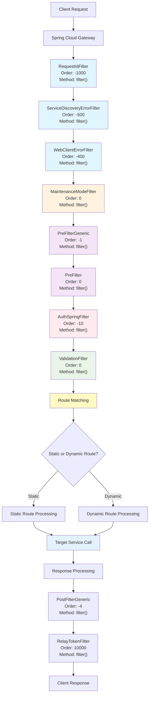
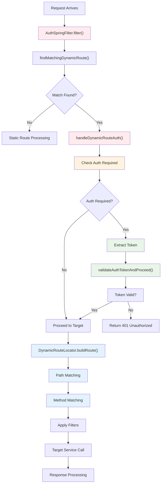
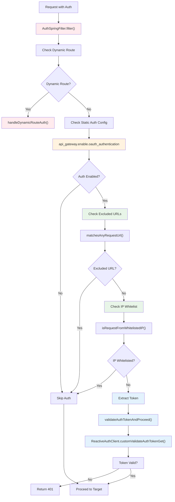
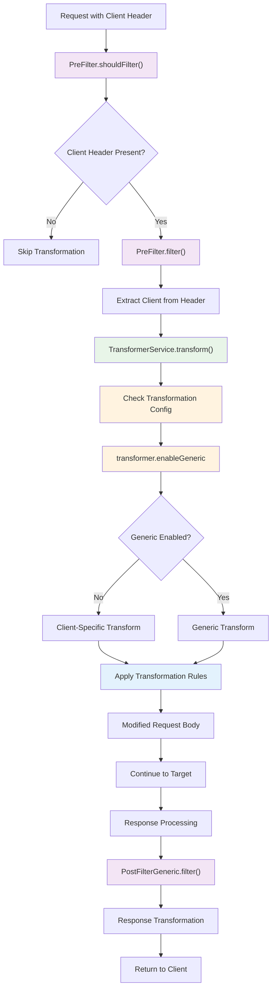
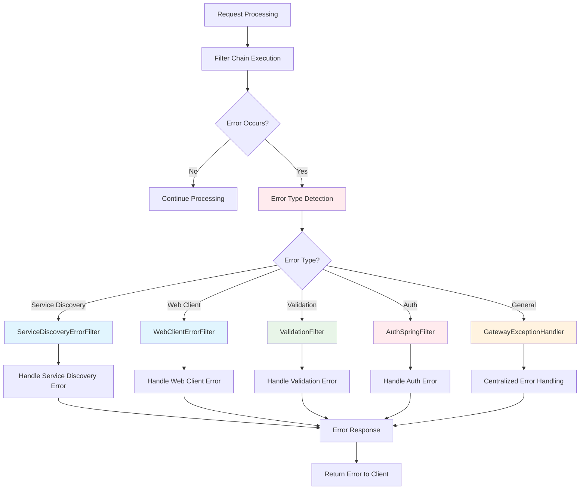
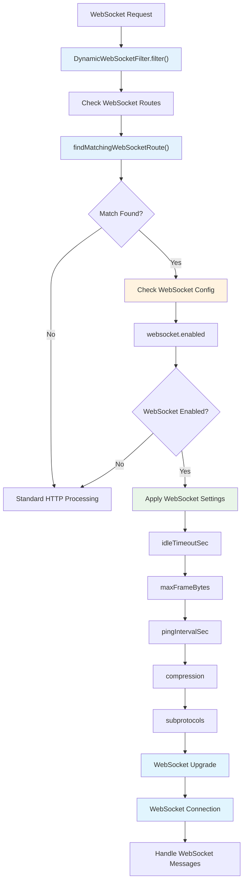
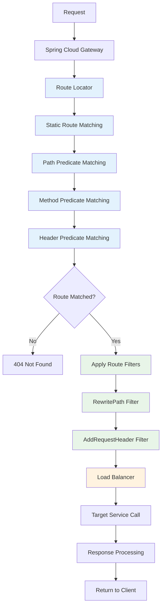

# API Gateway Request Flow Documentation

This document provides comprehensive flowcharts showing how the API Gateway handles different types of API requests, including all the code blocks, classes, methods, configurations, and filters that get executed during API handling.

## Table of Contents

1. [Main API Request Flow](#main-api-request-flow)
2. [Dynamic Routing Flow](#dynamic-routing-flow)
3. [Authentication Flow](#authentication-flow)
4. [Transformation Flow](#transformation-flow)
5. [Error Handling Flow](#error-handling-flow)
6. [WebSocket Flow](#websocket-flow)
7. [Static Route Flow](#static-route-flow)

---

## Main API Request Flow

This flowchart shows the complete request processing pipeline in the API Gateway.



### Key Components:

- **RequestIdFilter**: Generates unique request IDs for tracing
- **ServiceDiscoveryErrorFilter**: Handles service discovery failures
- **WebClientErrorFilter**: Manages web client errors
- **MaintenanceModeFilter**: Checks maintenance mode status
- **PreFilterGeneric**: Generic request preprocessing
- **PreFilter**: Client-specific request transformation
- **AuthSpringFilter**: Authentication and authorization
- **ValidationFilter**: Request validation
- **PostFilterGeneric**: Generic response processing
- **RelayTokenFilter**: Token relay for auth services

---

## Dynamic Routing Flow

This flowchart shows how dynamic routes are processed.



### Key Classes and Methods:

- **AuthSpringFilter.findMatchingDynamicRoute()**: Finds matching dynamic route
- **AuthSpringFilter.handleDynamicRouteAuth()**: Handles dynamic route authentication
- **DynamicRouteLocator.buildRoute()**: Builds route with predicates and filters
- **DynamicRouteAuthFilter.matchesPath()**: Matches request path to route pattern
- **DynamicRouteAuthFilter.matchesMethod()**: Matches HTTP method to route methods

---

## Authentication Flow

This flowchart shows the complete authentication process.



### Key Configuration Properties:

- **api_gateway.enable.oauth_authentication**: Enables/disables authentication
- **gor.whitlelistedIpSubnets**: IP addresses exempt from authentication
- **AUTH_EXCLUDED_API_PATTERNS**: URL patterns that don't require authentication

---

## Transformation Flow

This flowchart shows how request/response transformations are handled.



### Key Classes and Methods:

- **PreFilter.shouldFilter()**: Checks if transformation is needed
- **TransformerService.transform()**: Performs request transformation
- **PostFilterGeneric.filter()**: Performs response transformation
- **ValidationBuilder.getAllEnabledValidations()**: Loads validation rules

---

## Error Handling Flow

This flowchart shows how errors are handled throughout the request lifecycle.



### Key Error Handling Components:

- **ServiceDiscoveryErrorFilter**: Handles service discovery failures
- **WebClientErrorFilter**: Manages web client errors
- **GatewayExceptionHandler**: Centralized error handling
- **ValidationFilter**: Request validation errors
- **AuthSpringFilter**: Authentication errors

---

## WebSocket Flow

This flowchart shows how WebSocket connections are handled.



### Key WebSocket Components:

- **DynamicWebSocketFilter**: Handles WebSocket route matching
- **WebSocketConfig**: Configuration for WebSocket connections
- **WebSocket upgrade handling**: Protocol upgrade from HTTP to WebSocket

---

## Static Route Flow

This flowchart shows how static routes (configured in bootstrap.yml) are processed.



### Key Static Route Components:

- **Route Locator**: Finds matching static routes
- **Predicate Matching**: Path, method, and header matching
- **Route Filters**: RewritePath, AddRequestHeader, etc.
- **Load Balancer**: Service discovery and load balancing

---

## Filter Execution Order

The following table shows the execution order of all filters in the API Gateway:

| Order | Filter | Purpose | Configuration |
|-------|--------|---------|---------------|
| -1000 | RequestIdFilter | Generate request IDs | Always enabled |
| -500 | ServiceDiscoveryErrorFilter | Handle service discovery errors | Always enabled |
| -400 | WebClientErrorFilter | Handle web client errors | Always enabled |
| -100 | DynamicRouteAuthFilter | Dynamic route authentication | Dynamic routing enabled |
| -50 | DynamicWebSocketFilter | WebSocket route handling | Dynamic routing enabled |
| -10 | AuthSpringFilter | Authentication | api_gateway.enable.oauth_authentication |
| -4 | PostFilterGeneric | Response transformation | transformer.enableGeneric |
| -1 | PreFilterGeneric | Request transformation | transformer.enableGeneric |
| 0 | PreFilter | Client-specific transformation | Client header present |
| 0 | ValidationFilter | Request validation | validationFilterOrder |
| 0 | MaintenanceModeFilter | Maintenance mode check | maintenance_mode.enabled |
| 1 | Client-specific filters | Various client transformations | Client-specific configs |
| 10000 | RelayTokenFilter | Token relay | Always enabled |

---

## Configuration Properties

### Core Configuration

```yaml
api-gateway:
  enable:
    oauth_authentication: false
    errorHandling: false
  dynamic-routing:
    enabled: true
    routes: []
```

### Transformation Configuration

```yaml
transformer:
  enableGeneric: false
  urlsList:
    ANY: ^/api/orders/\d+/\d+$
    POST: ^/api/orders/\d+/\d+$
```

### Validation Configuration

```yaml
validationFilterOrder: 0
```

### Maintenance Mode Configuration

```yaml
maintenance_mode:
  enabled: false
```

---

## Key Classes and Methods Reference

### Core Filter Classes

1. **RequestIdFilter**
   - `filter()`: Generates unique request IDs
   - `getOrder()`: Returns -1000

2. **AuthSpringFilter**
   - `filter()`: Main authentication logic
   - `findMatchingDynamicRoute()`: Finds dynamic routes
   - `handleDynamicRouteAuth()`: Handles dynamic route auth
   - `validateAuthTokenAndProceed()`: Validates tokens
   - `getOrder()`: Returns -10

3. **DynamicRouteLocator**
   - `buildRoute()`: Builds dynamic routes
   - `matchesPath()`: Path matching logic
   - `matchesMethod()`: Method matching logic

4. **ValidationFilter**
   - `filter()`: Request validation
   - `loadValidations()`: Loads validation rules
   - `getOrder()`: Returns validationFilterOrder

5. **TransformerService**
   - `transform()`: Request transformation
   - `transformResponse()`: Response transformation

### Configuration Classes

1. **DynamicRoutingProperties**
   - Contains dynamic route configuration
   - `DynamicRoute` inner class for route definitions

2. **ErrorHandlingConfig**
   - `gatewayExceptionHandler()`: Centralized error handling

3. **DynamicRouteConfiguration**
   - `dynamicRouteLocator()`: Route locator bean
   - `dynamicRouteRefreshService()`: Route refresh service

This documentation provides a comprehensive view of how the API Gateway processes requests through its various filters, configurations, and components.
